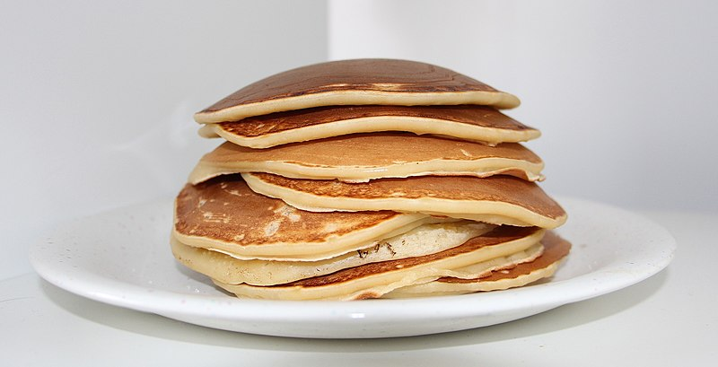

# Stacks
Stacks are relatively simple, as their name basically describes the fundamentals of exactly how they work and how you, as a programmer, should interact with them in software that you write. The easiest way to explain it is to compare a stack of data to a stack of pancakes. Generally speaking, you're supposed to only interact with the pancake that is currently on the top of the stack, which is also the newest, freshest (and most recently added) pancake that is currently in the stack (although other pancakes may well have been added and removed between this pancake being added and you now removing it).



<sub>image courtesy of Wikimedia commons user 'Chefkitchen90' (17 September 2019) and used under Creative Commons License</sub>

So with that visualization in mind, how does that apply to stacks of data? Simply put, while you could theoretically try and slip a pancake out from somewhere in the middle of the stack, the data structure that implements stacks of data doesn't allow that. Most commonly, the only allowed operations on a stack of data directly involve either counting the number of elements in the stack or acting on the "top" or "back" of the stack (two words for the same thing, used interchangeably. They represent the index of the element furthest away from zero). Common stack methods (when it is implemented as a class) include:

* `push(v)`
    * adds or "pushes" a value to the top of the stack. The new value becomes the value at the top of the stack.
* `pop()`
    * Removes or "pops" a value off of the top of the stack (and the function call returns the popped element in the process).
* `size()`
    * Returns the number of elements currently present in the stack
* `empty()`
    * Returns true if there are no elements currently present in the stack, or false otherwise.

They may also have a `top()` or `back()` function that simply returns the value located at the top of the stack without removing it from the stack, however that tends to be ever so slightly less common than the main four listed above.

## Purpose of a Stack
Stacks are primarily (almost exclusively, even) used to solve problems that require the stack's contents to be processed in a Last-in, First-out order (or First-in, Last-out, they mean the same thing). They also have the added benefits of incredible performance and improved data integrity (especially if implemented as a Class). Both of those benefits are attributed to the fact that you can only ever interact with the top of the stack.

## How to Build a Stack Class
The Stack data structure is the only data structure in this tutorial that can be emulated with a simple Python Array. That is because the simplest interpretation of a Stack is simply an array with more (intentionally) limited access options. This also means that stacks implemented with arrays as their underlying data storage structure would store each element of their data adjacent to one another in memory.


memory address| 0 | 1 | 2 | 3 | 4 |5| 6 | 7 | 8 | 9
-------|---|---|---|---|---|---|---|---|---|---
data   |'N'|'I'|'B'|'O'|'R'| ''|'D'|'E'|'R'|
||||||||||top


The primary reason that implementing a stack using an array (or defining a Stack class wrapped around an array) is so simple is because each of its features is already an built-in feature of arrays, so each of the major methods of the Stack data structure is effectively just a renaming of the appropriate array method.

```python
class Stack:
    def __init__(self):
        # Note the double underscore before the array's name.
        #   This denotes that the array should not be accessed directly
        #   by any code outside of the Stack's own defined class methods.
        self.__data = []

    def push(self, v):
        self.__data.append(v);

    def pop(self):
        return self.__data.pop()

    def size(self):
        return len(self.__data)

    def empty(self):
        return size() == 0
    
    def top(self):
        # Since the "top" or "back" of the stack is the element that
        #   was most recently appended to the far end of the array,
        #   it can be accessed via
        return self.__data[self.size() - 1]
```
However, because a Stack is so easy to define as simply a wrapper of Python's standard array, you may also see standard Python arrays that are simply ***used as*** Stacks in some cases while seeing Stacks actually implemented as classes in other cases.

Another reliable, but slightly more complicated way of implementing the Stack class would be to build it based off of the "Linked List" data structure covered in the next module of this Tutorial.

## Stacks of Functions
Another common use of stacks that we interact with in almost every electronic device these days is that of the function call stack, which is the stack of all the functions, processes, and programs currently running on your computer (although specific programs tend to keep track of their own internal stacks as well). Specifically, it is also the order in which those programs called (and were called by) one another. It extends all the way from the code that is allowing you to read this text right now to the actual machine code that is telling your hardware what to do to achieve the miracles of modern computing.

The function call stack is rather simple. Whenever you call a function, the called function gets added to the top of the function call stack, and when that function later completes and returns, it gets popped from that stack. 

But how does it know where to return ***to***? You guessed it: The function call stack. Because in order for that now-returning function to have been called in the first place, another function had to call it, and the function that called it was also placed into the function call stack by ***its*** caller. So whenever a function ends and returns, the sub-process that manages the flow of software control only needs to look at the top of the call stack so that it knows exactly which piece of instruction code to carry the return value back to so that the caller can continue its tasks. Those tasks could potentially involve adding even more functions to the call stack and continuing to wait for those returns as well.

Understanding the function call stack is very important for programmers, not only because it helps us better understand how our code will execute when we write it, but also because (in most modern programming languages) runtime error messages that result in crashes tend to include information about the top few layers of the function call stack for easier debugging In addition, knowledge of the functionc all stack helps us better test and debug our code while it is running by analyzing the call stack at the various breakpoints we set, so that we can more easily track down malfunction-producing defects.

## Performance of Stacks
As mentioned above Stacks offer incredible performance whenever the situation calls for their use. This is because interacting exclusively with the top of the stack makes it incredibly easy for the computer to interact with the Stack, without having to worry about certain pesky slowdowns that many of the other simple, array-based data structures have to worry about. In fact, each of the four main class methods used to implement the Stack operate in constant time (or, as written in Big O complexity Notation, they operate in O(1)). That is to say that for each of those four functions, the number of elements stored in the stack has no bearing whatsoever on how fast the method processes.

The only non-performant aspect of using a stack is inherited from the simple fact that it is usually implemented with an array as the base, underlying data structure. That aspect is that of dynamically reallocating arrays. Simply put, if a program tries to push() data onto a Stack after the underlying array reaches its maximum capacity, the program needs to allocate a new, larger block of memory and move each element of the underlying array to that larger element before the push() function can continue. Python and some other programming or simple scripting languages such as JavaScript or Lua will handle this reallocation automatically behind the scenes without the programmer having to write any code to implement that feature, but other languages like C++ do require that capability to be manually implemented. This particular downside to using arrays is not present when using a Linked List as the underlying data structure to a Stack, for reasons covered in the Linked List module.

## Common Errors when Working with Stacks
The most common error when working with stacks is expecting the Stack's contents to come out in the same order that they were entered in. The very nature of the First-in, Last-out order of the stack will cause the data to be output in the exact opposite order that it was inserted in, and that is (to quote a certain famous game developer) "A feature, not a bug" of the Stack data structure. As a result, when working with stacks, the programmer would do well to remember that one key feature of stacks.

## Example Exercise 1
The concept of a Stack is so simple that you may not even realize how many real world examples there are of its use. For example, every time you press the Back button on your browser to go back to the previous page, your browser uses a stack to determine which webpage to go Back ***to***. Let's actually use that example and attempt to make our own Back button for a browser (just as an example, it won't actually work on your browser). We will also be including both the Stack class from above and a rudimentary Browser class

```Python
class Stack:
    def __init__(self):
        self.__data = []
    
    def push(self, value):
        self.__data.append(value)
    
    def pop(self):
        return self.__data.pop()
    
    def size(self):
        return len(self.__data)

    def empty(self):
        return not self.size()

class WebBrowser:
    def __init__(self):
        self.__current_url = 'Home Page'
        self.__old_url_stack = Stack()

    def __navigate_to(self, url):
        self.__current_url = url
        print("Arriving at " + url)
    
    def go_back(self):
        old_url = self.__old_url_stack.pop()
        print("Returning to " + old_url)
        self.__navigate_to(old_url)

    def click_link(self, url):
        self.__old_url_stack.push(self.__current_url)
        print("Clicking link to " + url)
        self.__navigate_to(url)

browser_tab = WebBrowser()
browser_tab.click_link("Google.com")
browser_tab.click_link("Facebook.com")
browser_tab.go_back()
browser_tab.click_link("Amazon.com")
browser_tab.go_back()
browser_tab.go_back()
```

## Example Exercise 2 (Your turn)
Another example, although it may seem incredibly similar, would be to navigate your computer's file system in the same way. If you are looking at files in a certain file folder and you click the "back" button, you will be moved to your current folder's parent folder (that contains the current folder, of course). That implies that the tree of folders between your current location and the main menu of the C:/ Drive can be interpreted as a tack. Feel free to use the Stack implementation used in Example one, and the following stubbed out "File Browser" class for you to implement similar features to the Web Browser in example 1:

```Python
class FileBrowser:
    def __init__(self):
        self.__current_address = 'C:/'
        self.__previous_addresses = Stack()
    
    def __open_folder(self, full_path_to_folder):
        # the function that actually moves you into the provided folder
        pass

    def click_folder(self, child_folder_name):
        pass

    def go_back(self):
        pass

file_browser = FileBrowser()
file_browser.click_folder("Program Files")
file_browser.click_folder("Google Chrome")
file_browser.go_back()
file_browser.go_back()
file_browser.click_folder("users")
file_browser.click_folder("admin")
file_browser.click_folder("Documents")
file_browser.go_back()
file_browser.click_folder("Downloads")
file_browser.go_back()
file_browser.go_back()
file_browser.go_back()
```
Note that navigating a filesystem requires much different syntax than navigating the web. For this example, every time __open_folder is called, the the entire filepath from 'C:/' to the target folder must be passed into it, with slashes between the folder names.

Once you've completed your attempt, you can compare it to this [Solution](solutions/1_2_solution.py) to see how you did.

[Back to Welcome Page](0-welcome.md)