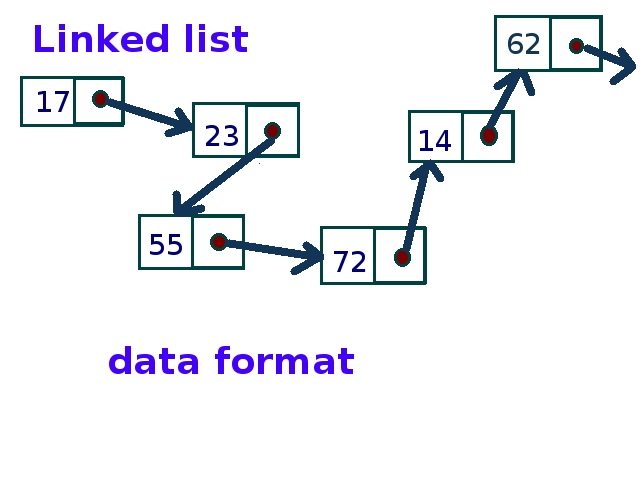

# Linked Lists
Linked lists are similar to array-based data structures in that they contain a series of data that can be iterated through linearly. That is roughly where the similarities end, however, as Linked Lists achieve all that they do by way of forming a chain of smaller "Nodes" that each contain an actual value for the Linked List to store, in addition to containing pointers (also called "Links" or "References") to the next node in the linked list (as well as usually having a pointer to the previous node in the list as well, making it a doubly-linked list).

The linked list class itself is more of a parent structure wrapped around a structure of connected nodes, keeping track of where the beginning and end of the node chain are, as well as defining a few methods of interacting with that chain of connected nodes. Think of it like a person holding both ends of a jumprope. If the person were to walk away, the jumprope would still exist. The person is just holding onto the jumprope and knows how to make the rope do neat tricks (apparently such as making the rope longer or shorter; it's not a perfect analogy).

## Nodes
As mentioned above, the Nodes themselves are somewhat of a Data Structure on their own, technically, because linking individual nodes together is still possible even without having the linked-list parent structure to keep track of the beginning and end of the list or offer more efficient ways of navigating and manipulating the list. I say "more efficient" ways, because each of those functions the linked-list parent structure provides is possible to implement as a standalone method of a node, but having an external parent structure allows that parent structure to keep up with the current head and tail of the linked-list, which makes several of its functions more efficient because they do not have to navigate as far to get to the node that is being changed.

The most important reason that nodes are used for the linked list data structure rather than relying on arrays like many other data structures do is simply because of the following utilities that nodes provide.

* Since Nodes are connected to one another by pointers rather than by being adjacent to one another in memory, a linked list will never have to be reallocated in bulk for passing a certain size threshold like dynamically allocated arrays would need. This is because each node is located at a distinct location in memory, and the only connections between two nodes are pointers to one another.

* Also by virtue of their non-proximal connections, any given node can be added to or removed from the linked list in constant time. This is because the process for actually removing a node from a linked list can only affect up to a maximum of three nodes. For example, when given a chain of Nodes A, B, and C (in that order) we can remove B by telling node A that its next node is now C, telling C that its previous node is now A, and finally deleting node B after it has been safely isolated from the rest of the linked list. On the other hand if we were to attempt to insert a new node D into the middle of the linked list, in that state (making it A, D, C), we would have to tell D that its new previous and next nodes were A and C (respectively) and then tell node A and C that their next and previous pointers (respectively) should now point to the D node instead. So once the correct node is found to operate on (which is the only weakness/shortcoming of linked lists, discussed in the ***Navigating a Linked List*** section below), operating on the linked list is an incredibly fast process and the time it takes to complete does not scale with the size of the linked list.

## Structure
Although the nodes of a linked list tend to be very far apart in memory, because of the way the link together similarly to chain links (with each node representing a link in the chain), a good visual aid on how nodes link together would be a chain of Carabiners.

Both images courtesy of Dylan Ruppell, taken 14 December 2022. Sharing under Creative Commons license.

Just like the above carabiners may initially seem jumbled and chaotic, the use of nodes scattered pseudo-randomly around memory may also initially seem jumbled and chaotic. But by keeping track of where the chain begins and ends, just as the linked list class keeps track of the head and tail nodes in its underlying chain of nodes, the programmer will know exactly how to unravel that seemingly jumbled mess into something the program can use.

image courtesy of Wikimedia commons user 'Hiteshsaldi' (15 April 2013), used under Creative Commons license.

## Purpose of a Linked List
The purpose of a linked list is primarily to provide efficient access to both ends of a linear data structure without the programmer needing to reallocate potentially massive data sets every time. It also has the aforementioned added benefit of not needing to move data when insertions or deletions occur in the beginning or middle of the data set.

The linked list data structure is best used when solving problems that capitalize on those strengths without needing to worry as heavily about the Linked List's singular key weakness:

## Navigating a Linked List
The slowest part of using a linked list is the navigation and/or traversal of it. In array-based data structures, programmers and their programs can zip right to the address of a specific piece of data simply by adding the index of that element to the memory address of the array's starting point.

Memory Address|0|1|2|3|4|5
-|-|-|-|-|-|-
Value|A|B|C|D|E|F

Programmers can access the 4th element of the array simply by adding 3 to the memory address of the first element. That is how code like `array[3]` works under the hood

Meanwhile, Linked Lists can only be navigated by starting at one end of the list (or an iterator from a previous traversal of the list) and navigating either forward or backward until the programmer can find what they are looking for. This leads to one of the simplest, most efficient O(1) operations in array-based data structures taking O(n) time in linked lists. As a result, any function of linked lists that involves traversing to a specific node (such as removing said node or adding a node before/after the found node) takes O(n) time despite the fact that the actual manipulation of the nodes once they are found takes O(1) time. There's also no known way around this that doesn't also simultaneously sacrifice all the benefits of a using a linked list in the first place.

## How to Build a Linked List
As mentioned above, a linked list is a collection of nodes, so therefore, when building a Linked List class in Python, a node subclass will need to be used.

As the source code for the linked list class is over 100 lines, it will not be included in the body of this document, however we encourage readers to review it [Here](example_source/2_0_linked_list.py) on another branch of this Tutorial's site.

## Common Errors when Working with Linked Lists
The most common errors encountered when working with linked lists occur primarily when inserting or removing nodes, and it occurs as a result of following the right procedures in the wrong order. For example, as mentioned above in the Nodes section, when inserting a new node into the middle of a list, the program must first tell the new node what its previous and next pointers should now point to. If the program attempts to point the adjacent nodes at this new node before pointing the new node at the adjacent nodes, the program could break the chain and temporarily lose a potentially massive portion of the linked list simply by losing track of the address to it. This could manually be remedied by travelling from that end of the linked list inward until the program can find the correct node and reattach it, but that is a massive inefficiency caused by, once again, doing the right things in the wrong order. That is most likely the most common error experienced when working with them.

## Example Exercise 1
As discussed in the previous module on Stacks, linked lists can be used as an alternative for arrays when constructing other data structures. For example, Queues (while not discussed explicitly in this Tutorial) can be built on the foundation of a linked list as well and for the purposes of a Queue, a linked list would serve quite well with excellent efficiency. This is because, similarly to Stacks, programs can only interface with the ends of Queues, either adding something to the back of the Queue or removing something from the front of the Queue (they are First-in, First-out and accessible from either end, as opposed to stacks which are Last-in, First-out because they are accessible from only one end). Operating only at the ends of the data set allows the linked list's O(1) speed in doing so to really shine while the lack of an option to access the middle of a Queue whatsoever neatly evades that singular weakness of Linked Lists in accessing the middle of the data set. As such, we're going to build a rudimentary Queue out of a linked list in the following [example](example_source/2_1_linked_list_queue.py).

## Example Exercise 2 (Your turn)
Just like with Queues as discussed above, a linked list would serve excellently as the underlying data structure for a Stack, and for all the same reasons, too. The only feature the linked list does not currently offer is a method of keeping track of the number of elements present in the underlying linked list, which will need to be tracked *somewhere* in order to implement the Stack's `size()` and `empty()` methods. Try your hand at implementing this feature and building a Stack using a linked list.

Once your attempt is complete, feel free to compare it to the following [solution](solutions/2_2_solution.py). Note, the provided solution removes a lot of code from the linked list class definition that is simply unneeded by the Stack, but you won't need to do that, and we don't necessarily recommend it either.

[Back to Welcome Page](0-welcome.md)