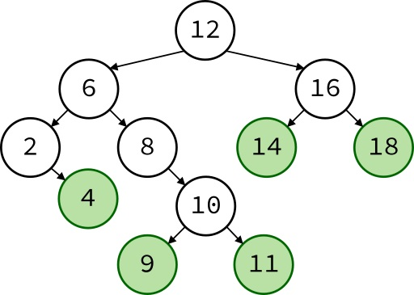

# Trees
Trees are similar to Linked Lists in that they are constructed of smaller Nodes linked together. The substantial differences between Trees and Linked Lists stem from the differing ways they utilize those nodes and what those organizational structures allow the data structures to excel at.

In the case of trees (especially Binary Search Trees, or BSTs's), they excel at the sorting of data upon insertion and the navigation of that data once it is has been inserted.

## Nodes, revisited
In the case of trees, especially BSTs, Nodes generally have one pointer to a parent node and two pointers that point to the "left" and "right" child nodes. Some implementations, especially those that traverse trees recursively rather than iteratively, may omit the presence of a parent pointer, as the recursive traversal method has no need for it and control will pass to the parent node on its own whenever it is needed. The the highest and most central node in the tree is called the root node. This root node is the node that the Tree class keeps track of (similar to how the linked list class kept track of the head and tail of its data). The root node has no parent node and every other node in the entire tree descends from it

## Structure
Ironically despite the fact that the data structure in question is named the "Tree", it is generally depicted in a way that better represents the roots of a tree, with the "root" node almost always being shown at the top of a tree diagram, and the "leaves" (i.e. nodes at the bottom that have no child nodes of their own) are likewise almost always being shown at the bottom of the diagram.

Image courtesy of Wikimedia Commons user 'Pat Hawks' (25 August 2016). Used under Creative Commons License.

In this case, the root node is depicted by the circle labeled 12, and the leaves are all highlighted in Green. The arrows represent the parent-child relationship between the nodes, with the arrows pointing from the parent to the child.

## Purpose of a Tree
Fundamentally, the purpose of a Tree in programming is to have a data structure that efficiently stores data in a way that allows you to access and modify any specific location in the data structure in much fewer operations than other data structures would reasonably be able to achieve, as discussed in more detail in the next section. Another important aspect to Trees as a data structure is especially common in a certain type of tree called a Binary Search Tree, which automatically sorts all of its nodes when the nodes are inserted into the tree. In a BST, all of a node's left-side descendants have data values less than the node's value, and all of the node's right-side descendants have data values greater than the node's value. This also makes searching for values much more efficient as well, because searching a sorted data set allows you to search in O(log n) time rather than the O(n) time it would take to search an unsorted data set.

## Performance of Trees
Let's dive further into the performance aspects of using Tree data structures. The tree is one of the few datatypes where many of its methods operate on O(log n) time. This means that while the complexity of those methods may be large in larger data sets, they are more efficient than even O(n) time. This is because O(n) time requires the function to visit each element once, meanwhile an O(log n) executed on a very large, balanced tree would happen exponentially faster. And I'm not using the word 'exponentially' as an exaggeration there, either. Let's imagine a Binary Search Tree holding just over a thousand elements (1023 or 210 - 1, to be more exact). A function of O(n) complexity would potentially have to visit every single one of those nodes in order to complete its task, but a function operating in O(log n) time would only have to navigate ***ten*** nodes. Double the size of the tree to 2047 and you would double the O(n) complexity but a function of O(log n) complexity would only need to visit ***one*** more node than before.

Element Count | Maximum Visited Nodes in O(n) | Maximum visited Nodes in O(log n) (assuming a balanced tree)
-|-|-
1|1|1
3|3|2
7|7|3
15|15|4
31|31|5
63|63|6
...|...|...
1,048,575|1,048,575|20
...|...|...
1,073,741,823|1,073,741,823|30

Diagram depicting O(log n) complexity in comparison to O(n) complexity. O(log n) computational difficulty grows linearly while O(n) difficulty grows exponentially

The Tree methods that operate in O(log n) time this way are those three that search for a specific location in the tree, either to see if the target value exists, remove it if it does, or add it if it doesn't. Trees do also have three common methods related to them that operate in O(n) time, and those functions either count the number of layers in the tree or enable the use of the forward and backward iterators, all three of which explicitly need to visit every node in the tree in order to fulfill their purpose.

In some implementations, it also has a few simple O(1) complexity functions to fetch the number of elements in the tree and whether or not it is empty.

## Navigating a Tree
As mentioned above, many implementations of trees navigate the data structure recursively, as opposed to iteratively. Recursion is the process of breaking down a computational problem into smaller and smaller problems until a solution to one of those smaller problems can eventually lead to a solution to the larger problem. Generally this involves a single function that is designed to do all of the following in order to achieve recursion.

1. The function will determine whether or not it has reached a predefined result such as the end of a data set or a solution to the smaller piece of the larger problem (sometimes the end of the data set and the solution to the specific task at hand are one and the same)
2. If the base case was not satisfied, the function will separate the existing problem into smaller pieces, determine which to process next, and call a new instance of itself to begin processing that smaller problem set

Step 1 is called a Base Case and is used to prevent infinite recursion by reporting a result back up to a higher instance of the function, which will then, in turn, carry said result further back down the function call stack until the function that initially called the recursive function finally gets the results it was looking for. Step 2 is the actual recursion procedure itself that decides how to break down the problem into its smaller chunks.

While iterative navigation methods also exist and are usually comparably performant, iterative implementations are also more complicated to write, involving several nested conditional statements.

However, regardless of which method is used to navigate the tree, it is still important to know exactly ***how*** to navigate the tree with these methods. Simply put, to navigate the tree, your code should examine the node it is currently at to determine if that it is the node you are looking for. If the current node is not the desired destination, then the program determines whether either of the subtrees below the current node could contain the desired destination, and either continues navigating toward the destination or returns some signal to indicate that the destination could not be reached.

## How to Build a Tree Class
Now that we've talked about all the things a Tree can do and all the benefits of using those features to potentially solving some of your present or future programming problems, let's actually discuss how to create a Tree. We'll actually be creating the Binary Search Tree we've been talking about rather than the "simpler" types of trees. Like many other data structures, the underlying structure is relatively simple, and the majority of the complexity comes from the specific ways in which you add to, remove from, or traverse the data structure. All of those features are performed by functions, and there are two versions of each function (one of which to recurse through the tree and one that the Tree users call to initiate that recursion process). This leads to the code being, once again, a bit too long and unwieldy to embed directly into this document, but you can find it [Here](example_source/3_0_BST.py) for review or for your examples later.

## Common Errors when Working with Trees
There are a few common errors when working with trees, as the drawback of being so efficient in such broad ranges of uses is the complexity required to implement and maintain its features. The most common errors involve malfunctions in the traversal of the various levels of the tree, especially in iterative traversal implementations. This can often be mitigated when using the simpler, easier to understand recursive methods of traversal, however in extremely large datasets, recursive traversal could result in software malfunctions or crashes caused by stack overflow (not to be confused with buffer overflow) where your computer or programming language either cannot or will not accept any further recursion and forces the software or some part of it to crash. The last major source of Errors when working with Trees is that, if you directly insert a set of ordered values in that same, sorted value order, the resulting Tree will look (and perform) suspiciously like a linked list. This is especially true if the BST does not have any manual or automatic balancing algorithms included (the example code does not, and such algorithms are not in the scope of this tutorial)
## Example Exercise 1
For the first example of a Tree's use in this module, we will be inserting several randomly generated numbers into a BST and then getting another randomly generated number and searching the BST to see if the new numberis one of the numbers that had previously been added. You can see the example code [Here](example_source/3_1_BST_RNG.py).
## Example Exercise 2 (Your turn)
As for the example you can work on for this module, you may have noticed that the example Class code did not contain a function for removing values from the tree. That is because there are some major considerations when it comes to howto remove an element, especially when it has two child nodes, each of which could also have their own child nodes. Luckily you won't be asked to write that function as it takes over 90 lines of code to implement and several levels of complicated nested conditionals. You are simply asked to write the two ***much*** simpler functions that send informatino into that larger function.

In this exercise, you will be working with a list of names. Someone misformatted a few names and made a mistake that they couldn't correct properly. Please implement the functionality that allows their correction attempt to function. I left some guidance for you in the following [template file](exercises/3_2_exercise.py).

Once you have finished with your attempt, feel free to compare your work with the [solution file](solutions/3_2_solution.py) to see how you did.

[Back to Welcome Page](0-welcome.md)